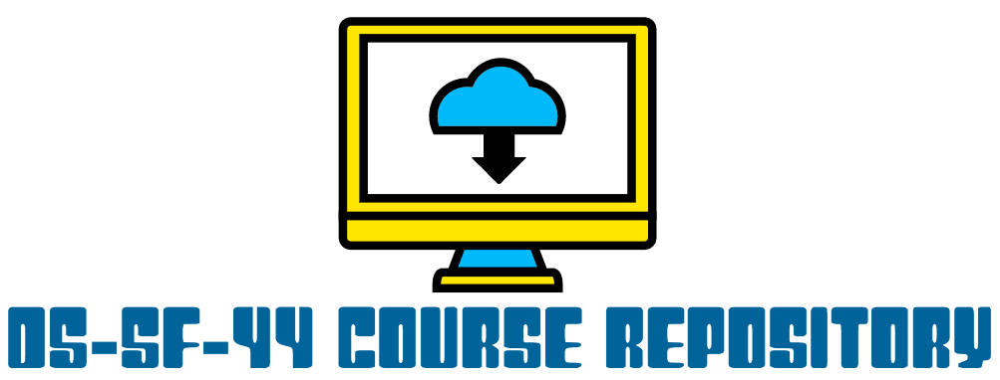

Course materials for General Assembly's Data Science course in San Francisco (3/20/18 - 5/24/18)

**Instructor:** [Adam Jones](https://www.linkedin.com/in/adam-p-jones/)

**Course Times**

Tues/Thursday: 6:30pm - 9:30pm

**Office hours:** 

Thurs: 5:30pm - 6:30pm (right before class)  
- Additional hours available upon request

All courses / in-person office hours will be held at GA, 225 Bush Street

**[Course Project Information](projects/final-projects/project.md)**

**[Course Project Examples](projects/project-examples.md)**

Tuesday | Thursday | HW
--- | --- | --- 
3/20: [Introduction / Expectations / Intro to Data Science](./lessons/lesson-01/README.md) | 3/22: [Numpy & Pandas](./lessons/lesson-02/README.md) | HW 1 Assigned (Tues)
3/27: [Statistics Fundamentals I](./lessons/lesson-03/README.md) | 3/29: [Statistics Fundamentals II](./lessons/lesson-04/README.md) | HW 1 Due & HW 2 Assigned (Tues)
4/3: [Data Science Toolkit](./lessons/lesson-05/README.md) | 4/5: [Introduction to Linear Regression](./lessons/lesson-06/README.md) | HW 2 Due & HW 3 Assigned (Tues)
4/10: [Evaluating Model Fit](./lessons/lesson-07/README.md) | 4/12: [Intro to classification](./lessons/lesson-08/README.md) | Final Project Pt. 1 Due & Final Project Pt. 2 Assigned (Th)
4/17: [Intro to Logistic Regression](./lessons/lesson-09/README.md) | 4/19: [Communicating the Results of Logistic Regression](./lessons/lesson-10/README.md)  | HW 4 Assigned (Tues) & HW 3 Due (Th)
4/24: [Clustering](./lessons/lesson-11/README.md) | 4/26: [Decision Trees](./lessons/lesson-12/README.md) | Project Proposal due & HW 4 Due (Th)
5/1: [NLP with Classification](./lessons/lesson-13/README.md) | 5/3: [Latent Variable Models](./lessons/lesson-14/README.md) | Final Project Pt. 2 Due & Final Project Pt. 3 Assigned (Th)
5/8: Time-series Data | 5/10: Modeling Time-series Data | Final Project Pt. 3 Due & Final Project Pt. 4 Assigned (Th)
5/15: Databases | 5/17: Next Steps with Data Science | Final Project Pt. 4 Due & Final Project Pt. 5 Assigned (Th)
5/22: Neural Networks | 5/24: Final Presentations!!! | Final Project Pt. 5 Due (Th)

### Installation and Setup
* Install the [Anaconda distribution](http://continuum.io/downloads) of Python 2.
* Install [Git](http://git-scm.com/book/en/v2/Getting-Started-Installing-Git) and create a [GitHub](https://github.com/) account.
* Once you receive an email invitation from [Slack](https://slack.com/), add your photo and join our team!

### Resources
* [PEP 8 - Style Guide for Python](http://www.python.org/dev/peps/pep-0008)
* [Learn How to Think Like a Computer Scientist](http://interactivepython.org/runestone/static/thinkcspy/toc.html#t-o-c)

