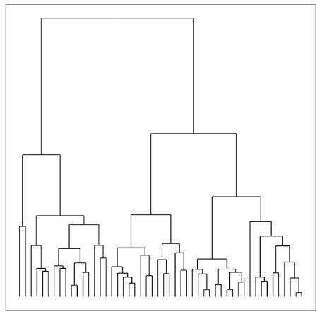

#  Clustering
DS | Lesson 11

### LEARNING OBJECTIVES
*After this lesson, you will be able to:*

- Understand unsupervised versus supervised learning
- Apply k-Means and DBSCAN clustering
- Combine clustering with classification and regression

### STUDENT PRE-WORK
*Before this lesson, you should already be able to:*

- Use sckit-learn to fit models
- Use seaborn to create plots
- Understand the similarities/differences between _supervised_ and _unsupervised_ learning models

### LESSON GUIDE
| TIMING  | TYPE  | TOPIC  |
|:-:|---|---|
| 5 min  | [Opening](#opening) | Unsupervised Learning |
| 5 min  | [Introduction](#intro-clustering) | Clustering |
| 10 min  | [Demo](#kmeans) | K-Means: Centroid clustering |
| 10 min  | [Demo](#dbscan) | DBSCAN: Density-based clustering |
| 10 min  | [Demo](#hierarchical) | Hierarchical clustering |
| 15 min  | [Guided Practice](#guided-practice-cm) | Clustering Metrics |
| 5 min  | [Guided Practice](#guided-practice-bit) | Clustering, Classification, and Regression |
| 5 min  | [Conclusion](#conclusion) | Review and Next Steps |

---

<a name="opening"></a>
## Opening: Unsupervised Learning (5 mins)
#### What is it?

So far, all the algorithms we have used have been supervised. Meaning- each observation (row of data) came with one or more labels, either categorical variables (classes) or measurements (regression).

_Unsupervised_ learning has a different goal: feature discovery.

_Clustering_ is a common and fundamental example of unsupervised learning. Clustering algorithms try to find meaningful groups (i.e. clusters) within data.

<a name="intro-clustering"></a>
## Introduction: Clustering


Cluster analysis or clustering is the task of grouping a set of objects in such a way that objects in the same group (called a cluster) are more similar (in some sense) to each other than to those in other groups (clusters).
It’s a common task in exploratory data mining, and a powerful technique for statistical data analysis, which is used in lots of fields, including machine learning, pattern recognition, image analysis, and data compression (to name a few).

Cluster analysis itself is not one specific algorithm, but the general task to be solved. It can be achieved by various algorithms that differ significantly in their notion of what constitutes a cluster and how to efficiently find them.

**Check:** Why might data often appear in centered clusters?

> Answer: Objects in the same group (called a cluster) are more similar (in some sense) to each other than to those in other groups (clusters).

Cluster analysis or clustering is the task of grouping a set of objects in such a way that objects in the same group (called a cluster) are more similar (in some sense) to each other than to those in other groups (clusters).

It’s a common task in exploratory data mining, and a powerful technique for statistical data analysis, which is used in lots of fields, including machine learning, pattern recognition, image analysis, and data compression (to name a few).

Cluster analysis itself is not one specific algorithm, but the general task to be solved. It can be achieved by various algorithms that differ significantly in their notion of what constitutes a cluster and how to efficiently find them.

In the figure above, we see an example of centroid-based clustering, which is a method of organizing data into groups based on similar characteristics. The most representative point (the mean/center) within the group is called the centroid.

## Introduction: Density-based clustering

Compared to centroid-based clustering like K-Means, density-based clustering works by identifying "dense" clusters of points, which allows it to learn clusters of arbitrary shape and identify outliers in the data.

**Check:** Why might data often appear in density-based clusters?

> Answer: Not all clusters are round.
> - They come in all shapes and sizes (see example below)


## Introduction: Hierarchical clustering

Hierarchical clustering is kind of a bread and butter technique when it comes to visualizing a high dimensional data. It's very simple to use. The format is fairly intuitive for most people, and it can serve as a really quick way to get a sense of what's going on in a very high dimensional data set.

**Check:** How is unsupervised learning different from classification?
> Answer: Clustering is an _unsupervised_ learning technique and classification is a _supervised_ learning technique

**Check:** Can you think of a real-world clustering application?
> Answer:
> 1. Recommendation Systems e.g. Netflix genres
> 2. Medical Imaging: differentiate tissues
> 3. Identifying market segments
> 4. Discover communities in social networks
> 5. Lots of applications for genomic sequences (homologous sequences, genotypes)
> 6. Earthquake epicenters
> 7. Fraud detection

<a name="kmeans"></a>
## K-Means: Centroid clustering
In a clustering problem, we are typically given an un-labeled data set and we would like to have an algorithm automatically group the data into coherent subsets or into clusters for us.

The K Means algorithm is by far the most popular, by far the most widely used clustering algorithm.

So, today we're going to talk about what the K Means Algorithm is and how it works. Like many other algorithms in this class, the K means clustering algorithm is best illustrated in pictures. So start with the demo below.

[Try this awesome demo](http://www.naftaliharris.com/blog/visualizing-k-means-clustering/)

Let's say I want to take an unlabeled data set, and I want to group the data into two clusters. If I run the K Means clustering algorithm, here is what I'm going to do.
1. The first step is to randomly initialize k points, called the cluster centroids
- I have k of them because I want to group my data into k clusters
2. Next, K Means (as an iterative algorithm) then does two things over and over until completion:
- First, a *cluster assignment step*, where each point is assigned to the closest centroid.
- Second, a *move centroid step*.

#### Cluster assignment step
  The first of the two steps in the loop of K means, is the cluster assignment step. What that means is that, it's going through each of the examples, and depending on whether it's closer to one cluster centroid or the other cluster centroid, it’s going to assign each of the data points to one of the two cluster centroids.

#### Move centroids step
  The other part of K means, in the loop of K means, is the move centroid step. What we are going to do is, we are going to take the two cluster centroids and we are going to move them to the average of the points colored the same color.
  Then I'm going to do another move centroid step. And then I'm going to do another cluster assignment step, etc, etc...and we're done. And in fact if you keep running additional iterations of K means from here the cluster centroids will not change any further and the colors of the points will not change any further.

If we consider the K means algorithm more formally...
  The K means algorithm takes two inputs. One is a parameter K, which is the number of clusters you want to find in the data. For now we're going to tell the algorithm how many clusters we think there are in the data set. K means also takes as input unlabeled training data and because this is unsupervised learning, we don't have the labels Y anymore.

  To reiterate- the first step is the random initialization of k cluster centroids, which we will call mu 1, mu 2, up to mu k. Then the inner loop of k means repeats the following: For each training example, I'm going to classify it according to the nearest centroid - i.e. the cluster assignment step. Said another way, I'm going to take my Ith example Xi and I'm going to measure it's distance to each of my cluster centroids (mu1, mu2, etc.). Importantly, I'm working to _minimize_ this distance between Xi and the cluster centroid. Then, I'm going to move the location of each cluster to the average of the points assigned to that cluster.

<a name="dbscan"></a>
## DBSCAN: Density-based clustering
DBSCAN is another algorithm that's less well known than k-means, but has slightly nicer properties so it's good to be familiar with. How dbscan works is given points, say, in a two dimensional space as always, we're going to look for points that are separated by a distance of no more than some epsilon.

So, if you can hop from one point to another, by hopping no more than epsilon at each point, then all of those points will be considered to be in the same cluster and so whenever you need to jump a little further than epsilon, you'll be entering a new cluster.

Two parameters:
- Distance threshold (epsilon)
- Minimum neighbors (for outliers- if you put min neighbors at zero, you'd get outliers in their very own little cluster)


These points are within epsilon, these points are within epsilon, and so on. And so you sort of induce this graph over the data. And so all of these, B is reachable from A by hops of no more than epsilon, so all of these are in the same cluster. And actually C is also reachable from B by hops in the same cluster but N is not, and so N is in a different cluster (or an outlier).

All right, so there are some __advantages__:  
- It can find non linearly separable clusters
  Often, there's no line you can draw to separate two clusters. And yet, usually, there's kind of a dense region and another dense region. And DBSCAN finds this naturally, but k-means won't.
- No dependence on starting conditions
  There is no dependence on a fixed number of starting to clusters like k-means has. You sort of compute this from any of the vertices in the graph and start making hops.

Some __disadvantages__:
It's sensitive to Euclidean distance measure problems. And if you remember a few lectures ago, I made a point to say that whenever you see Euclidean distance, you should be thinking about there's one big major problem with it, which is the curse of dimensionality. So as you get a very, very large number of dimensions, Euclidean distance starts to become somewhat meaningless- it starts to get bigger, and bigger, and bigger, and the data sets start to get sparser, and sparser, and sparser.
But k-means also has this problem, because it also tends to rely on Euclidean distance. And you actually can define other distance measure and adapt k-means and DBSCAN both to use them.

[Try this awesome demo](http://www.naftaliharris.com/blog/visualizing-dbscan-clustering/)

**Check:** How does DBSCAN differ from k-means?
> Answer: *Density based* clustering algorithm finds non linear shapes based on density.
*K-means* follows a simple way to classify data set into a certain number of clusters (k clusters - fixed a priori). These centroids should be placed in a careful way because different locations cause different results

<a name="hierarchical"></a>
## Hierarchical clustering
Even though we’ve already plowed through a ton of material, I wanted to spend some time discussing another really popular form of clustering called hierarchical clustering.



But before we delve into the specifics of hierarchical clustering, let's spend a little bit of time motivating why one might want to use hierarchical clustering. And one is because it allows us to avoid that pesky problem of having to fix the number of clusters ahead of time.
Another benefit is that the dendrogram (see figure above), which captures the results of the hierarchical clustering, can allow us to very quickly visualize clusterings at different granularities without having to rerun the algorithm.
Additionally, hierarchical clustering typically allows us to specify any distance metric we want for defining distances between points. Whereas, with k-means for example, we were implicitly specifying you Euclidean distance as our distance metric.
And finally, hierarchical clustering can allow us to capture more complex shapes to our clusters than the types of things that we saw with k-means or our mixture models. So for example, in k-means, remember that we were implicitly assuming spherically symmetric clusters, and these can both be rather restrictive assumptions. But through hierarchical clustering, we can capture more intricate shapes of distributions.

We’ll explore hierarchical models in much greater detail when we get to decision trees in a few weeks. So, for now we can use sklearn and treat the model like a black box and fit it like so:
```python
from sklearn.cluster import AgglomerativeClustering
est = AgglomerativeClustering(n_clusters=4)
est.fit(X)
labels = est.labels_
```

Finally, here is a figure from the scikit learn python library website, which shows the differences between the performances of various clustering algorithms (we've only talked about two of these models in class so far- k means and DB scan).
In these 4 challenge problems, DBScan is the only one that does the right thing in every case!

<a name="guided-practice-cm"></a>
## Clustering Metrics

Evaluating the performance of a clustering algorithm is not as trivial as counting the number of errors or the precision and recall of a supervised classification algorithm. In fact, it's a much more complicated problem than scoring classification. There’s a large number of clustering algorithms and likewise for possible evaluation metrics for clustering. The choice of a suitable clustering algorithm and of a suitable measure for the evaluation depends on the clustering objects and the clustering task.

One of the more popular is the Silhouette Coefficient:
- First we measure the average distance between our data point and the points in its own cluster (*distance a*)
- Then, we measure the average distance between our data point and the points in the closest cluster (*distance b*)

If our data point is well grounded in its cluster, b needs to be large and a needs to be small, so that the difference between them (b - a), is as large as possible. To normalize this score, we have to divide it by the maximum of a and b.

The score is bounded between -1 for incorrect clustering and +1 for highly dense clustering. The silhouette score ranges for a point in the middle of a cluster will be quite high. Scores around zero indicate overlapping clusters.

__Example implementation__
```python
from sklearn import metrics
from sklearn.cluster import KMeans
kmeans_model = KMeans(n_clusters=3, random_state=1).fit(X)
labels = kmeans_model.labels_
metrics.silhouette_score(X, labels, metric='euclidean')
```

Other metrics are available, as well:
- Including some based on mutual information
- Homogeneity
- Adjusted Rand Index

<a name="guided-practice-bit"></a>
## Clustering, Classification, and Regression

**Check:** How might we combine clustering and classification?

- We can use clustering to discover new features and then use those features for either classification or regression

- For classification, we could use e.g. k-NN to classify new points into the discovered clusters (i.e. unsupervised prediction)

- For regression, we could use a dummy variable for the clusters as a variable in our regression

__Exercise__
1. Using the [starter code](./code/starter-code-11.ipynb), perform a k-means clustering on the flight delay data.
2. Use the clustering to create a classifier.

<a name="conclusion"></a>
## Conclusion

- Clustering is used to discover features, e.g. segment users or assign labels (such as species)

- Clustering may be the goal (user marketing) or a step in a data science pipeline

### BEFORE NEXT CLASS
|   |   |
|---|---|
| **UPCOMING PROJECTS**  | [Unit Project 4](../../projects/unit-projects/project-04/README.md)  |

### ADDITIONAL RESOURCES
- [K-means clustering demo](http://www.naftaliharris.com/blog/visualizing-k-means-clustering/)
- [Demo of K-means assumptions](http://scikit-learn.org/stable/auto_examples/cluster/plot_kmeans_assumptions.html)
- [DB-scan clustering demo](http://www.naftaliharris.com/blog/visualizing-dbscan-clustering/)
- [Netflix Challenge clustering article](../../student-resources/articles/netflix_challenge.pdf)
