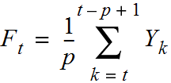
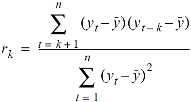
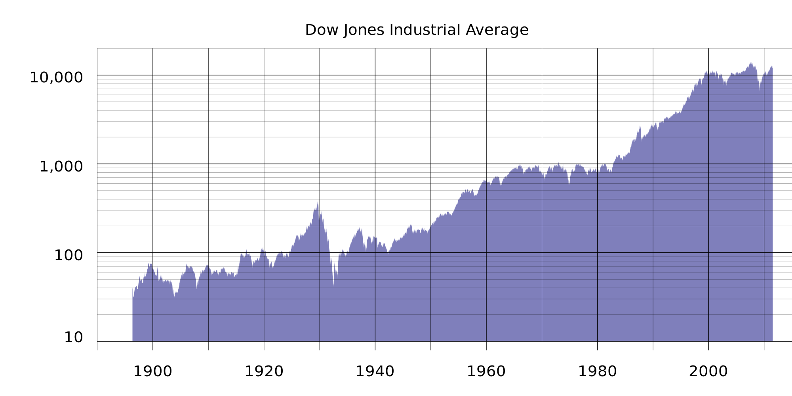
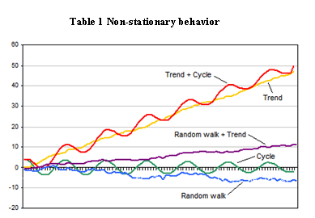
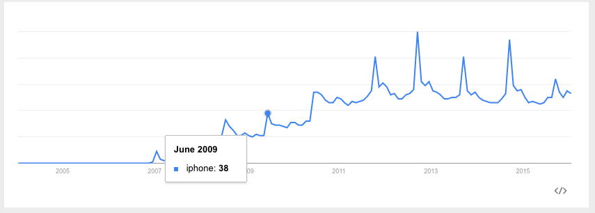
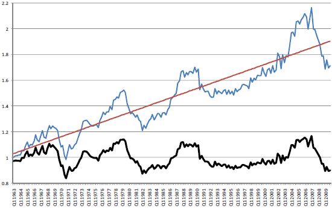

#  Modeling Time Series Data
DS | Lesson 16

### LEARNING OBJECTIVES
*After this lesson, you will be able to:*
- Model and predict from time series data using AR, ARMA or ARIMA models
- Code those models in `statsmodels`

### STUDENT PRE-WORK
*Before this lesson, you should already be able to:*
- Prior definition and Python functions for moving averages and autocorrelation
- Prior exposure to linear regression with discussion of coefficients and residuals
- `pip install statsmodels` (should be included with Anaconda)

### LESSON GUIDE
| TIMING  | TYPE  | TOPIC  |
|:-:|---|---|
| 5 min  | [Opening](#opening)  | Lesson Objectives  |
| 45 min  | [Introduction](#introduction)   | Intro: Time Series Models |
| 75 min  | [Demo/Codealong](#demo1)  | Demo/Codealong: Time Series Models in Statsmodels  |
| 50 min  | [Independent Practice](#ind-practice)  | Walmart Sales Data: Time Series Modeling Exercise |
| 5 min  | [Conclusion](#conclusion)  |   |

---
<a name="opening"></a>
## Opening (5 min)

In the last class, we focused on exploring time-series data and common statistics for time-series analysis. In this class, we'll advance those techniques to show how to predict or forecast from time series data.

If we have a sequence of values (a time series), we will use the techniques in this class to predict a future value. For example, we may want to predict the number of sales in a future month.

<a name="introduction"></a>
## Intro: What are (is) time series models? (60 mins)

Time series models are models that will be used to predict a future value in the time-series. Like other predictive models, we will use prior history to predict the future! Unlike previous models, we will use the _outcome_ variables from earlier in time as the _inputs_ for prediction.

While most of the previous lesson was focused on REFINING time-series data using descriptive statistics or visualization to identify patterns, this class will be focused on BUILDING models for prediction.

As with previous modeling exercises, we will have to evaluate different types of models to ensure we have chosen the best one.

We will want to evaluate on _held-out set or test data_ to ensure our model performs well on unseen data.

Unlike previous modeling exercises, we won't be able to use standard cross-validation for evaluation!

Since there is a time component to our data, we **cannot choose training and test examples at random.** Suppose we did - what if we selected a random series of data points for training and a random 20% for test. If we used those 80% to predict sales in a future month and we tested on our 20%, what would go wrong?

Unfortunately, the training dataset likely contains data from _before_ AND _after_ a test dataset. **This would not be possible in real-life,** therefore, it's not a valid test of how our model would perform!

Instead, we will typically train exclusively on values from earlier (in time) in our data and then test our values at the end of data period.

### Properties for time-series prediction
In our last class we saw a few statistics for analyzing time series. We looked at moving averages to evaluate the local behavior of the time series.

**Check:** Recall the definition for moving average - what is its purpose?

> Answer: A _moving average_ is an average of _k_ surrounding data points in time.

 

We also looked at autocorrelation to compute the relationship of the data with prior values.

**Check:** Recall the definition for autocorrelation - what is its purpose?.


> _Autocorrelation_ is how correlated a variable is with itself. Specifically, how related variables from earlier in time are with variables from later in time.



To compute autocorrelation, we fix a _lag_, k, which is how many time-points earlier we should use to compute the correlation.

We'll use these values to assess how we plan to model our time-series. Typically, for a high-quality model, we require some autocorrelation in our data. We can compute autocorrelation at various lag values to determine how far back in time we need to go.

Additionally, many models make an assumption of _stationarity_, which means assuming the mean and variance of our values is the same throughout.

This means that while the values (of sales, for example) may shift up and down over time, the _mean value_ of sales is constant, as well as the variance (i.e. there aren't many dramatic swings up or down).

As always, these assumptions may not represent real-world data, which we must be aware of when breaking the assumptions of our model for others! For example, typical stock market performance is not stationary. In this plot of Dow Jones performance since 1986, the mean is clearly increasing over time.



Below are simulated examples from "Investopedia" of non-stationary time-series and why they might occur:



Often, if these assumptions don't hold we can alter our data to make them true. Two common methods are _detrending_ and _differencing_.

_Detrending_ would remove any major trends in our data. We could do this in many ways, but the simplest way is to fit a line to the trend, then make a new series of the difference between the line and the true series.

For example, in iPhone google searches, there is a clear upward (non-stationary) trend:



If we fit a line to this data first, we can create a new series that is the difference between the true number of searches and the predicted searches. We can then fit a time-series model to this difference.

Below is an example looking at U.S. housing prices over time. Clearly, there is a trend upward. This makes the time-series non-stationary, as the mean home price is increasing. The line fit through it represents the trend.

The bottom figure is the "detrended" data, where the datapoint at certain points is the value of the line at that time subtracted from the difference. This data now has a fixed mean and may be easier to model.



This pattern is similar to mean-scaling our features in earlier models with `StandardScaler`.

A simpler but related method is _differencing_. This is very closely related to the `diff` function we saw in the last class.

Instead of predicting the (non-stationary) series, we can predict the difference between two consecutive values. We will see that the **ARIMA** model incorporates this approach.

**Check:** Non-stationary data is the most common type of data, since almost any interesting dataset is non-stationary. Can you think of some datasets that are stationary?

### Timeseries models

In the rest of this lesson, we are going to build up to the **ARIMA** time-series model. This models combines the ideas of differencing and two models we will see below: **AR** or autoregressive models and **MA** or moving average models.

#### AR Models

**Autoregressive (AR) models** are those are that use data from previous time-points to predict the next time-point. These are very similar to previous regression models, except as input - we'll take some previous outcome.

If we are attempting to predict weekly sales, we'll use sales from a previous week as our input. Typically, AR models are noted AR(p), where _p_ indicates the number of previous time points to incorporate, with AR(1) being the most common.

In an autoregressive model, similar to standard regression, we'll learn regression coefficients, where the inputs or features are the previous _p_ values. Therefore, we will learn _p_ coefficients or \beta values.

If we have a time series of sales per week, \y_i, we can regress each y_i from the last _p_ values.

y_i = \intercept + \beta_1 * y_(i-1) + \beta_2 * y_(i-2) + ... + \beta_p * y_(i-p) + random_error

As with standard regression, our model assumes that each outcome variable is a linear combination of the inputs and a random error term.  

For AR(1) models, we will learn a _single_ coefficient. This coefficient will tell us the relationship between the previous value and the next one. A value > 1 would indicate a growth over previous values.

Note: This would typically represent non-stationary data, since if we compound the increase then the values would be continually increasing.

Values between 1 and -1 represent increasing and decreasing patterns, respectively. As with other linear models, interpretation becomes more complex as we add more factors; in other words, as we go from AR(1) to AR(2) since we begin to have significant _multi-collinearity_.

Recall, _autocorrelation_ is the correlation of a value with itself. We compute correlation with values _lagged_ behind. A model with high-correlation implies that the data is highly dependent on previous values and an autoregressive model would perform well.

Autoregressive models are useful for learning falls or rises in our series. This will weight together the last few values to make a future prediction. Typically, this model type is useful for small-scale trends, such as an increase in demand or a change in tastes that will gradually increase or decrease the series.

**Check:** If we observe an autocorrelation near 1 for lag 1, what do we expect the single coefficient in an AR(1) model to be? > 1, between 0 and 1 or < 1?
> - If the data was non-stationary, > 1, our data may be increasing over time
> - If the data was stationary, between 0 and 1, in fact the coefficient and lag 1 autocorrelation should be the same.

If we observe an autocorrelation of 0?
> - Around 0 - our model won't be very good, but really we should just predict a single value (intercept) throughout.


#### Moving Average Models

**Moving average models**, as opposed to autoregressive models, do not take the previous outputs (or values) as inputs, but instead take the previous error terms. We will attempt to predict the next value based on the overall average and how incorrect our previous predictions were.

This model is useful for handling specific or abrupt changes in a system. If we consider that autoregressive models are slowly incorporating changes in the system by combining previous values, moving average models use our previous errors.

Using these as inputs helps model sudden changes by directly incorporating the prior error. This is useful for modeling a sudden occurrence - like something going out of stock affecting sales or a sudden rise in popularity.

As in autoregressive models, we have an order term, _q_, and we refer to our model as _MA(q)_.  This moving average model is dependent on the last _q_ errors.

If we have a time series of sales per week, \y_i, we can regress each \y_i from the last _q_ error terms.

    y_i = \mean + \beta_1 * \error_i + ... \beta_q * \error_q

Of course, we don't have the errors terms when we start - where do they come from?

This requires a more complex fitting procedure than we have seen, where we iteratively fit a model (perhaps with random error terms), compute the errors and then refit, over and over again.

We'll include the mean of the time series and that is why we call this a moving average, as we assume the model takes the mean value of a series and randomly jumps around it.

With this model, we'll learn _q_ coefficients. In an MA(1) model, we learn one coefficient where this value indicates the impact of our previous error on our next prediction.

#### ARMA Models

Another stepping stone to **ARIMA** models are **ARMA** models.

_ARMA_, pronounced 'R-mah', models combine the autoregressive models and moving averages. For an ARMA model, we specify two model settings `p` and `q`, which correspond to combining an AR(p) model with an MA(q) model.

An ARMA(p, q) model is simply a combination (sum) of an AR(p) and MA(q) model.

Incorporating both models allows us to mix two types of effects.

Autoregressive models slowly incorporate changes in preferences, tastes, and patterns. Moving average models base their prediction not on the prior value but the prior error, allowing us to correct sudden changes based on random events - supply, popularity spikes, etc.

#### ARIMA Models

**ARIMA**, pronounced 'uh-ri-mah', is an AutoRegressive Integrated Moving Average model.

In this model, we learn an ARMA(p, q) to predict not the value of the series, but the difference of the two series.

Recall the pandas `diff` function. This computes the difference between two consecutive values. In an ARIMA model, we attempt to predict this difference instead of the actual values.


                        \y_t - \y_(t-1) = ARMA(p, q)

This handles the stationarity assumption we wanted for our data. Instead of detrending or differencing manually, the model already knows how to do this.

An ARIMA model has three parameters and is specified ARIMA(p, d, q), where _p_, is the order of the autoregressive component, _q_, is the order of the moving average component, and _d_ is the degree of differencing. In the above, we set _d = 1_ .

For a higher value of _d_, for example, d=2, the model would be:

                         diff(diff(y)) = ARMA(p, q)

We would apply the `diff` function _d_ times.

Compared to an ARMA model, ARIMA models do not rely on the underlying series being stationary. The differencing operation can _convert_ the series to one that is stationary. Instead of attempting to predict the values over time, our new series _is_ the difference in values over time.

Since ARIMA models automatically include differencing, we can use this on a broader set of data without assumptions of a constant mean.

<a name="demo1"></a>
## Demo: Modeling in time series in statsmodels (45 mins)

To explore time series models, we will continue with the Rossmann sales data.  This dataset has sales data for sales at every Rossmann store for a 3-year period, as well indicators of holidays and basic store information.

In the last class, we saw that we would plot the sales data at a particular store to identify how the sales changed over time.  Additionally, we computed autocorrelation for the data at varying lag periods. This helps us identify if previous timepoints are predictive of future data and which time points are most important - the previous day? week? month?

```python
import pandas as pd

# Load the data and set the DateTime index
data = pd.read_csv('./code/datasets/rossmann.csv', skipinitialspace=True)

data['Date'] = pd.to_datetime(data['Date'])
data.set_index('Date', inplace=True)

# Filter to Store 1
store1_data = data[data.Store == 1]

# Filter to open days
store1_open_data = store1_data[store1_data.Open==1]

# Plot the sales over time
store1_open_data[['Sales']].plot()
```

**Check**: Compute the autocorrelation of Sales in Store 1 for lag 1 and 2. Will we be able to use a predictive model - particularly an autoregressive one?

```python
store1_data.Sales.autocorr(lag=1) # -0.12
store1_data.Sales.autocorr(lag=2) # -0.03
```

We do see some minimal correlation in time, implying an AR model can be useful. An easier way to diagnose this may be to plot many autocorrelations at once.

```python
%matplotlib inline
from pandas.tools.plotting import autocorrelation_plot

autocorrelation_plot(store1_data.Sales)
```

This shows a typical pattern of an autocorrelation plot - it should decrease to 0 as lag increases! However, it's hard to observe exactly what the values are.

In this class, we will use `statsmodels` to code AR, MA, ARMA and ARIMA models.

`statsmodels` is a machine learning package, similar to `sckit-learn`.  While it lacks many of the features of `scikit-learn` for evaluation and production level models, it does include many more niche statistical models, including time series models. It also provides a nice summary utility to help diagnose models.

`statsmodels` also has a better autocorrelation plot, which can look at fixed numbers of lag values.

```python
from statsmodels.graphics.tsaplots import plot_acf

plot_acf(store1_data.Sales, lags=10)
```

Here we observe autocorrelation at 10 lag values. 1 and 2 are what we saw before. This implies a small, but limited impact based on the last few values, suggesting that an autoregressive model might be useful.

**Check**: We also observe a larger spike at 7 - what does that mean?

> That's the amount of days in a week!

If we observed a handful of randomly distributed spikes - that would imply a MA model may be useful. This is because those random spikes suggest that at some point in time, something changed in the world and all values are shifted up down from there in a fixed way.

That may be the case here, but if we expand the window we can see that the spikes occur regularly at 7 days windows. This means we have a weekly cycle!

```
plot_acf(store1_data.Sales, lags=25)
```

Let's start by investigating AR models.

### AR, MA and ARMA models in Statsmodels

To explore AR and ARMA models, we will use `sm.tsa.ARMA`. Remember, an ARMA model is a combination of autoregressive and moving average models.

We can train an autoregressive model by turning off the moving average component (setting q = 0).

```python
from statsmodels.tsa.arima_model import ARMA

store1_sales_data = store1_open_data[['Sales']].astype(float)
model = ARMA(store1_sales_data, (1, 0)).fit()
model.summary()
```

By passing the `(1, 0)` in the second argument, we are fitting an ARMA model as ARMA(p=1, q=0). Remember, an ARMA(p, q) model is AR(p) + MA(q). This means that an ARMA(1, 0) is the same as an AR(1) model.

In this AR(1) model we learn an intercept value, or base sales values. Additionally, we learn a coefficient that tells us how to include the last sales values. In this case, we take the intercept of ~4700 and add in the previous months sales * 0.68.

Note the coefficient here does not match the lag 1 autocorrelation - implying the the data is not stationary.

We can learn an AR(2) model, which regresses each sales value on the last two, with the following:

```python
model = ARMA(store1_sales_data, (2, 0)).fit()
model.summary()
```

Here we learn two coefficients, which tells us the effect of the last two sales values on current sales. To make a sales prediction for a future month, we would combine the last two months of sales with the weights or coefficients learned.

While this model may be able to better model the series, it may be more difficult to interpret.

To start to diagnose the model, we want to look at the _residuals_.

**Check:** What are residuals? In linear regression, what did we expect of residuals?

_Residuals_ are the errors of the model, or a measure of how off our prior predictions were.

What we ideally want are randomly distributed errors that are fairly small. If the errors are large then clearly that would be problematic. If the errors have a pattern, particularly over time, then we have overlooked something in the model or certain periods of time are different than the rest of the dataset.

We can plot the residuals as below:

```python
model.resid.plot()
```

Here we saw large spikes at the end of each year, indicating that our model does not account for holiday spikes. Of course, our models are only related to the last few values in the time series, and don't take into account the longer seasonal pattern.

We can also plot the autocorrelations of the residuals. In an ideal model, these would all nearly be 0 and hopefully random.

```python
plot_acf(model.resid, lags=50)
```

This aspect is also troubling - the autocorrelation plot shows a clear pattern where errors are increasing and decreasing every week.

To expand this AR model to a ARMA model, we can include the moving average component as well.

```python
model = ARMA(store1_sales_data, (1, 1)).fit()
model.summary()
```

Now we learn two coefficients, one for the AR(1) component and one for the MA(1)

**Check:** Take a moment to look at the coefficients and offer an interpretation.

Remember this is an AR(1) + MA(1) model. So the AR coefficient represents dependency on the last value and the MA component represents any spikes independent of the last value.

The coefficients here are 0.69 for the AR component and -0.03 for the MA component. The AR coefficient is the same as before (decreasing values) and the MA component is fairly small (which we should have expected from the autocorrelation plots).

### ARIMA models in Statsmodels

To train an ARIMA model in `statsmodels`, we can change the `ARMA` model to `ARIMA` and additionally provide the differencing parameter. To start, we can see that we can train an ARMA(2,2) model by training an ARIMA(2, 0, 2) model.

```python
from statsmodels.tsa.arima_model import ARIMA

model = ARIMA(store1_sales_data, (2, 0, 2)).fit()
model.summary()

```

We can see that this model in fact simplifies automatically to an ARMA model.  If we change the differencing parameter to 1, we train an ARIMA(2, 1, 2). This predicts the difference of the series.

```python
model = ARIMA(store1_sales_data, (2, 1, 2)).fit()
model.summary()
```

For a moment, let's remove the moving average component since it wasn't particularly useful before.

```python
model = ARIMA(store1_sales_data, (2, 1, 0)).fit()
model.summary()
```

This is now an AR(1) model on the differenced data.  We learn a single coefficient of -.18.

**Check:** Does this match the lag 1 autocorrelation of the differenced series? Is the data stationary?

Yes, we can compute the lag 1 auto correlation of the difference series and see if they match!

```python
store1_sales_data.Sales.diff(1).autocorr(1) #-0.181
```
Also we can plot it to see the difference.

```python
store1_sales_data.Sales.diff(1).plot()
```

**Check**: Notice this looks generally true, but the variance is not constant. Why not?

> Answer: It is mostly the same throughout the series except around the holidays.

From our models, we can also plot future predictions and compare them with the true series. To compare our forecast with the true values, we can use the `plot_predict` function.

We can compare the last 50 days of true values and predictions as values:

```python
model.plot_predict(0, 50)
```

This function takes two arguments which are the start and end index of the dataframe to plot. Here, we are plotting the last 50 values.

To plot earlier values, with our predictions extended out, we do the following. This plots true values in 2014, and our predictions 200 days out from 2014.

```python
import matplotlib.pyplot as plt

fig, ax = plt.subplots()
ax = store1_sales_data['2014'].plot(ax=ax)

fig = model.plot_predict(0, 200, ax=ax, plot_insample=False)
```

Additionally, we can revisit our diagnostics to check if our models are working well.

**Check:** Plot the residuals and autocorrelation of residuals to test that model is working well. Are there patterns or outliers?

The two previous problems remain: large errors around the holiday period and these errors have high autocorrelation.

We can alter the AR model to adjust for a piece of this - increasing the lag to 7.

```
model = ARIMA(store1_sales_data, (7, 1, 2)).fit()
model.summary()

plot_acf(model.resid, lags=50)
```

This removes some of the autocorrelation in the residuals, but large discrepancies still exist. However, they exist where we are breaking our model assumptions as well, which is important to keep in mind.

**Check:** Have the students alter the time period of predictions and p, d, q parameters. Do any of these improve the diagnostics? What does changing p and q imply based on the autocorrelation plot? How about d?

After some practice with altering p, q, d - there aren't many models that fix the issue left.

- Increasing p would increase the dependency on previous values further (longer lag), but this isn't necessary past a given point.
- Increasing q would increase the dependency of an unexpected jump at a handful of points, but we did not observe that in our autocorrelation plot.
- Increasing d would increase differencing, but with d=1 we saw a move towards stationarity already (except at a few problematic regions). Increasing to 2 may be useful if we are saw an exponential trend, but that we did not here.

There are variants of ARIMA that will handle the seasonal aspect better, known as Seasonal ARIMA. In short, these models fit two ARIMA models, one of the daily frequency and another on the seasonal frequency (monthly or yearly, whichever the pattern may be).

Issues with seasonality could also be handled by pre-processing tricks such as detrending.


<a name="ind-practice"></a>
## Practice: Walmart Sales Data: Time series Modeling Exercise (50 mins)
> Students should work through the [starter-code](./code/starter-code-16.ipynb)

To practice, let's analyze the weekly sales data from Walmart over a two year period from 2010 to 2012. The data is separated by store and by department, but we'll focus on analyzing one store for simplicity.

To setup the data:

```python
import pandas as pd
import numpy as np

%matplotlib inline

data = pd.read_csv('./datasets/train.csv')
data.set_index('Date', inplace=True)
data.head()
```

1. Filter the dataframe to Store 1 sales and aggregate over departments to compute the total sales per store.
1. Plot the rolling_mean for `Weekly_Sales`. What general trends do you observe?
1. Compute the 1, 2, 52 autocorrelations for `Weekly_Sales` and/or create an autocorrelation plot.
1. What does the autocorrelation plot say about the type of model you want to build?
1. Split the weekly sales data in a training and test set - using 75% of the data for training
1. Create an AR(1) model on the training data and compute the mean absolute error of the predictions.
1. Plot the residuals - where are their significant errors.
1. Compute and AR(2) model and an ARMA(2, 2) model - does this improve your mean absolute error on the held out set.
1. Finally, compute an ARIMA model to improve your prediction error - iterate on the p, q, and parameters comparing the model's performance.

> Answers can be found in the [solution code](./code/solution-code-16.ipynb)

<a name="conclusion"></a>
## Conclusion (5 mins)
- Time series models use previous values to predict future values, also known as forecasting.
- AR and MA model are simple models on previous values or previous errors respectively.
- ARMA combines these two types of models to account for both local shifts (due to AR models) and abrupt changes (MA models)
- ARIMA models train ARMA models on differenced data to account
- None of these models perform very well for data that has lots of random variation - for example, this isn't very useful with searches or sales that tend to increase in short bursts.

***

### BEFORE NEXT CLASS
|   |   |
|---|---|
| **Due Today** | [Final Project, Part 3](../../projects/final-projects/03-exploratory-analysis/README.md)
| **Upcoming Projects** | [Final Project, Part 4](../../projects/final-projects/04-notebook-rough-draft/README.md)

### ADDITIONAL RESOURCES
- [ARIMA model overview](https://www.quantstart.com/articles/Autoregressive-Integrated-Moving-Average-ARIMA-p-d-q-Models-for-Time-Series-Analysis)
- [Time Series Analysis in Python with statsmodels](http://conference.scipy.org/proceedings/scipy2011/pdfs/statsmodels.pdf)
- [Investopedia: Stationarity](http://www.investopedia.com/articles/trading/07/stationary.asp)
- [First Place Entry in Walmart Sales Prediction](https://www.kaggle.com/c/walmart-recruiting-store-sales-forecasting/forums/t/8125/first-place-entry)
- [Google Search Terms predict market movements](https://www.quantopian.com/posts/google-search-terms-predict-market-movements)
